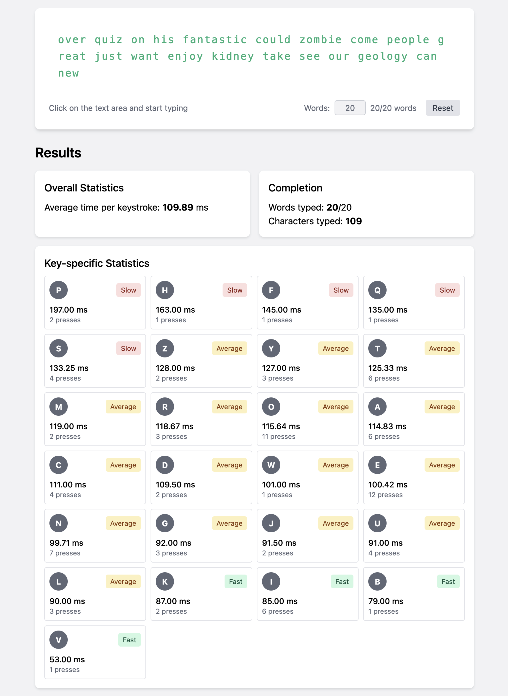

# Tapping Term Tracker

A web-based tool to help keyboard enthusiasts optimize their QMK/ZMK firmware tapping term settings by measuring individual key press durations.

## About

The Tapping Term Tracker helps mechanical keyboard users determine optimal tapping term values for their QMK or ZMK firmware by measuring how long they naturally hold each key. By analyzing these measurements, users can customize their keyboard's firmware settings to better match their typing style.

### What is the Tapping Term?

In QMK/ZMK firmware, the "tapping term" is the maximum time allowed between pressing and releasing a key for it to be registered as a "tap" rather than a "hold" action. This is crucial for keys that serve dual purposes (e.g., a key that produces a character when tapped but activates a layer or modifier when held).

## Features

- Measures individual key press durations (excluding spacebar)
- Provides statistics sorted from slowest to fastest keys
- Color-coded performance indicators (fast, average, slow)
- Customizable word count for testing
- Balanced key distribution in test text to ensure all keys are measured

## Usage

1. Visit [the website](https://enubia.github.io/tapping-term-tracker/) (or run it locally)
2. Set your desired word count (20-200 words)
3. Click on the text area and type the displayed text
4. Review your results, focusing on keys with longer press times
5. Use these measurements to adjust your keyboard's tapping term settings

## Key Statistics

The app categorizes your key presses as:

- **Fast**: 20% faster than your average keystroke
- **Average**: Within 20% of your average keystroke
- **Slow**: 20% slower than your average keystroke

Keys that consistently register as "slow" might benefit from longer tapping term settings in your keyboard firmware.

## Technical Details

- Built with vanilla JavaScript for maximum compatibility
- Uses the Performance API for precise timing measurements
- Responsive design with Tailwind CSS
- Implements keyboard event trapping to accurately measure press durations

## Limitations

As noted in the app:

> Results are relative measurements only. Physical key switch characteristics (spring weight, actuation point) and system latency aren't accounted for in these measurements.

## Local Development

To run this project locally:

1. Clone the repository
2. Open `index.html` in your web browser
3. No build steps or dependencies required!

## License

MIT License - Feel free to use, modify and distribute as needed.